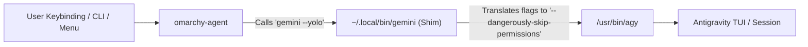

# Omarchy Agent: Antigravity CLI (`agy`) Full Integration Guide

This skill provides the comprehensive architecture, configuration, and automation recipes to seamlessly integrate **Google Antigravity CLI (`agy`)** into **Omarchy Linux**.

---

## 🎯 Objectives & Deliverables

1. **Default Agent Replacement**:
   - Map Omarchy's system-wide default coding agent from the legacy/deprecated `gemini` agent to `agy`.
   - Preserve complete compatibility with Omarchy CLI commands (`omarchy agent`, `omarchy default agent`, `omarchy agent prompt "..."`), Quickshell menus (`SUPER + SPACE`), and Hyprland hotkeys (`SUPER + SHIFT + CTRL + A`).
   - **Zero system tampering**: No edits to `/usr/share/omarchy/` so configurations survive all `omarchy update` cycles.

2. **24/7 Live Status Bar Quota Monitoring**:
   - Display real-time 5-hour session and weekly quota pools (both Gemini and Claude/GPT OSS models) on the Omarchy status bar via `ai-usagebar`.
   - Run a lightweight, headless `systemd` user daemon that keeps Antigravity's internal Language Server RPC active **without keeping an open terminal window** and with **0% idle CPU usage**.

---

## 🧠 Architectural Deep-Dive: How & Why It Works

### Pillar 1: The Omarchy Agent Dispatch System & The Shim Pattern

#### The System Constraints in Omarchy
Omarchy manages AI coding agents through `/usr/share/omarchy/bin/omarchy-agent`. The dispatch logic enforces a hardcoded whitelist:
```bash
case "$agent" in
  opencode|gemini|copilot|crush|claude|grok|codex|omp|pi) ... ;;
  *) echo "Unsupported default agent: $agent" >&2; exit 1 ;;
esac
```
If a user attempts to set `omarchy default agent agy`, the command fails with `Unsupported default agent: agy`. Furthermore, editing `/usr/share/omarchy/` directly is an anti-pattern because any upstream system update will overwrite `/usr/share/omarchy/bin/omarchy-agent`.

#### The Transparent Wrapper (Shim) Solution
To achieve complete compatibility without modifying system files:
1. We keep Omarchy's internal default agent setting as `gemini` (`~/.config/omarchy/defaults/agent`).
2. We place a transparent wrapper script at `~/.local/bin/gemini` (which takes precedence over system paths via `$PATH`).
3. The wrapper translates Omarchy's flags to Antigravity CLI flags:
   - Omarchy passes `--yolo` (unattended mode) $\rightarrow$ wrapper translates to `--dangerously-skip-permissions` for `agy`.
   - Omarchy passes `--prompt-interactive "<text>"` or `-i` $\rightarrow$ wrapper translates to `-i "<text>"`.
   - Omarchy passes `--prompt "<text>"` or `-p` $\rightarrow$ wrapper translates to `-p "<text>"`.
   - All other parameters are passed through as-is (`exec agy "${args[@]}"`).



---

### Pillar 2: Status Bar Quota Monitoring & The Headless Stream Daemon

#### How Antigravity Quota Reporting Works
Antigravity exposes user quota metrics (5-hour session reset percentage and weekly quota limits) through its embedded Language Server (LS) via a dynamic local TCP port (`127.0.0.1:<port>`) using the `RetrieveUserQuotaSummary` JSON-RPC method.

`ai-usagebar` (the status bar plugin for Omarchy) inspects `/proc` to locate the active `agy` process, determines its dynamic listening port, and queries the live quota stats.

#### The Challenge with Interactive Sessions
In default CLI usage, the Language Server RPC process terminates the moment the terminal window is closed. As a result, the status bar would display "Offline" or fail to retrieve live quotas whenever `agy` is not actively open in a visible window.

#### The Solution: Headless Stream-JSON Daemon
By launching `agy` in `stream-json` mode and keeping `stdin` open with `tail -f /dev/null`:
```bash
tail -f /dev/null | /usr/bin/agy --input-format stream-json --output-format stream-json
```
- `agy` initializes its background Language Server and listens on a dynamic localhost socket port.
- It waits silently for JSON input on `stdin`, consuming **0.0% CPU** and ~50MB of RAM.
- `ai-usagebar` discovers this daemon process and polls quota statistics 24/7.
- Managing this via a `systemd --user` service ensures it starts on login, restarts on crashes, and runs seamlessly in the background.

---

## 🤝 User Confirmation & Preferences (用户偏好确认原则)

> [!IMPORTANT]
> **AI Agent Execution Rule**: When an AI agent executes this skill, it **MUST NOT** modify configuration files or deploy daemons silently without confirming the user's intent first.

### Pre-Execution Confirmation Checklist
Before running the setup script or applying manual steps, confirm the following choices with the user:
1. **Default Agent Mapping**: Confirm that the user wishes to set `gemini -> agy` as their primary Omarchy coding agent.
2. **Background Quota Daemon**: Ask if the user wants the 24/7 background systemd service (`agy-daemon.service`) enabled for continuous status bar quota tracking.
3. **Keybinding Customization**: Confirm whether the default shortcut (`SUPER + SHIFT + CTRL + A`) or a custom key combination is desired.

---

## ⚡ Quick Start (Automated Setup)

If you have cloned this repository or installed it via `npx skills add interjc/omarchy-skills`:

```bash
# Run the all-in-one idempotent setup script:
bash skills/omarchy-agent-agy/scripts/setup.sh
```

---

## 📖 Step-by-Step Manual Setup

Follow these steps to manually configure the complete integration from scratch.

### Step 1: Ensure Prerequisites

1. Ensure **Google Antigravity CLI (`agy`)** is installed:
   ```bash
   agy --version
   ```
2. Remove any legacy `gemini` npm/mise package to prevent PATH collisions:
   ```bash
   mise uninstall gemini 2>/dev/null || true
   npm uninstall -g @google/gemini-cli 2>/dev/null || true
   ```
3. Ensure `~/.local/bin` is in your `$PATH` (in `~/.bashrc` or `~/.zshrc`):
   ```bash
   export PATH="$HOME/.local/bin:$PATH"
   ```

---

### Step 2: Create the `gemini -> agy` Transparent Shim

Create `~/.local/bin/gemini`:

```bash
mkdir -p ~/.local/bin

cat << 'EOF' > ~/.local/bin/gemini
#!/bin/bash
# Wrapper redirecting Omarchy's legacy gemini agent calls to agy (Antigravity CLI)
args=()
while (($#)); do
  case "$1" in
    --yolo)
      # Omarchy uses --yolo for unattended default agent launches
      args+=(--dangerously-skip-permissions)
      shift
      ;;
    --prompt-interactive|-i)
      args+=(-i "$2")
      shift 2
      ;;
    --prompt|-p)
      args+=(-p "$2")
      shift 2
      ;;
    *)
      args+=("$1")
      shift
      ;;
  esac
done

exec agy "${args[@]}"
EOF

chmod +x ~/.local/bin/gemini
```

---

### Step 3: Configure Omarchy Default Agent

Set the default agent in Omarchy configuration:

```bash
mkdir -p ~/.config/omarchy/defaults
echo "gemini" > ~/.config/omarchy/defaults/agent
```

Verify with:
```bash
omarchy-default-agent
# Output: gemini
```

---

### Step 4: Customize Omarchy QuickShell Menu

To make the Omarchy launcher menu (`SUPER + SPACE`) display **Antigravity (agy)** instead of Gemini:

Edit `~/.config/omarchy/extensions/omarchy-menu.jsonc`:

```jsonc
{
  // Override legacy Gemini entry with Antigravity (agy)
  "setup.default.agent.gemini": {
    "icon": "󰫢",
    "label": "Antigravity (agy)",
    "checked": "[[ \"$(omarchy-default-agent)\" == \"gemini\" ]]",
    "action": "omarchy-default-agent gemini"
  }
}
```

Refresh the Quickshell menu cache:
```bash
omarchy menu refresh
```

---

### Step 5: Configure Hyprland Shortcut & Shell Aliases

1. **Hyprland Keybinding**:
   In `~/.config/hypr/bindings.lua`, bind the agent shortcut to open `agy` in a centered, floating Omarchy TUI window:
   ```lua
   -- Antigravity Agent (agy)
   hl.unbind("SUPER + SHIFT + CTRL + A")
   o.bind("SUPER + SHIFT + CTRL + A", "Antigravity Agent", "omarchy-launch-tui --app-id=org.omarchy.agent agy")
   ```
   Reload Hyprland:
   ```bash
   hyprctl reload
   ```

2. **Shell Alias**:
   Add to `~/.bashrc`:
   ```bash
   alias agent="agy"
   ```

---

### Step 6: Set Up the Headless Background Daemon

Create the user-level systemd service at `~/.config/systemd/user/agy-daemon.service`:

```ini
[Unit]
Description=Antigravity CLI Background Daemon for Quota Service
PartOf=default.target
After=network.target

[Service]
Type=simple
ExecStart=/bin/bash -c "tail -f /dev/null | /usr/bin/agy --input-format stream-json --output-format stream-json"
Restart=always
RestartSec=5
StandardOutput=journal
StandardError=journal
Environment=HOME=%h
Environment=XDG_CONFIG_HOME=%h/.config
Environment=XDG_DATA_HOME=%h/.local/share
Environment=XDG_CACHE_HOME=%h/.cache
Environment=XDG_STATE_HOME=%h/.local/state
Environment=XDG_RUNTIME_DIR=%t

[Install]
WantedBy=default.target
```

Enable and start the service:
```bash
systemctl --user daemon-reload
systemctl --user enable --now agy-daemon.service
```

Check the daemon status:
```bash
systemctl --user status agy-daemon.service
```

---

### Step 7: Configure `ai-usagebar` & Omarchy Status Bar

1. **Install `ai-usagebar` and plugin** (if not already installed):
   ```bash
   omarchy pkg aur add ai-usagebar-bin
   omarchy plugin add https://github.com/akitaonrails/ai-usagebar.git --enable
   ```

2. **Enable Antigravity in `~/.config/ai-usagebar/config.toml`**:
   ```toml
   [antigravity]
   enabled = true
   ```

3. **Verify Status Bar layout (`~/.config/omarchy/shell.json`)**:
   Ensure `akitaonrails.ai-usagebar` is included in `bar.layout.right`:
   ```json
   {
     "bar": {
       "layout": {
         "right": [
           { "id": "omarchy.tray" },
           { "id": "akitaonrails.ai-usagebar", "lastSelectedEntryId": "antigravity" }
         ]
       }
     }
   }
   ```

4. **Reload Omarchy Shell**:
   ```bash
   omarchy shell reload
   ```

---

## 🔍 Verification & Testing

### 1. Test CLI Dispatch & Flags
```bash
# Test direct agent launch
omarchy agent --inline --prompt "Hello Antigravity"

# Test default agent status
omarchy default agent
# Should output: gemini
```

### 2. Test Quickshell Menu
- Press `SUPER + SPACE`.
- Navigate to `Setup` $\rightarrow$ `Default Agent`.
- Verify **Antigravity (agy)** is listed with icon `󰫢` and marked with `✓`.

### 3. Test Hyprland Hotkey
- Press `SUPER + SHIFT + CTRL + A`.
- A floating terminal window (`app-id: org.omarchy.agent`) running `agy` should appear centered on screen.

### 4. Test Daemon & Quota Readout
```bash
# 1. Verify daemon is active
systemctl --user is-active agy-daemon.service
# Output: active

# 2. Test CLI quota query via ai-usagebar
ai-usagebar --vendor antigravity
```

Expected output:
```text
󰧑 3% · 1%

╭────────────────────────────╮
│       Google AI Pro        │
│ ────────────────────────── │
│   󰔟  Session (5h)          │
│   󰆧  Gemini             3% │
│   󰆧  Claude & GPT OSS   0% │
│ ────────────────────────── │
│   󰃰  Weekly                │
│   󰆧  Gemini             1% │
│   󰆧  Claude & GPT OSS   0% │
╰────────────────────────────╯
```

---

## 🛠️ Troubleshooting & FAQs

### Q1: `ai-usagebar` reports "No Antigravity Language Server found"
- **Cause**: The daemon is either not running or cannot be inspected by `ai-usagebar`.
- **Fix**:
  1. Check daemon status: `systemctl --user status agy-daemon.service`.
  2. Verify listening sockets:
     ```bash
     ss -tulpn | grep agy
     ```
  3. Restart daemon: `systemctl --user restart agy-daemon.service`.

### Q2: `omarchy agent` runs the old Gemini CLI instead of `agy`
- **Cause**: `$HOME/.local/bin` is placed after `mise` shims or `/usr/bin` in your `$PATH`.
- **Fix**: In `~/.bashrc` / `~/.zshrc`, ensure:
  ```bash
  export PATH="$HOME/.local/bin:$PATH"
  ```
  Run `which gemini` to confirm it resolves to `/home/<user>/.local/bin/gemini`.

### Q3: How much system resources does `agy-daemon` consume?
- **Resource Footprint**: `0.0%` CPU when idle, and approximately ~50MB of RAM. It does not perform continuous LLM polling; it only answers socket queries when `ai-usagebar` requests metrics.

---

## 📁 Reference Files

- [`scripts/setup.sh`](./scripts/setup.sh) — All-in-one idempotent setup script.
- [`references/gemini-wrapper.sh`](./references/gemini-wrapper.sh) — Standalone wrapper script.
- [`references/agy-daemon.service`](./references/agy-daemon.service) — Standalone systemd user service.
- [`references/omarchy-menu.jsonc`](./references/omarchy-menu.jsonc) — Quickshell menu override.
- [`references/ai-usagebar.toml`](./references/ai-usagebar.toml) — ai-usagebar configuration.
- [`references/hyprland-bindings.lua`](./references/hyprland-bindings.lua) — Hyprland hotkey configuration.
